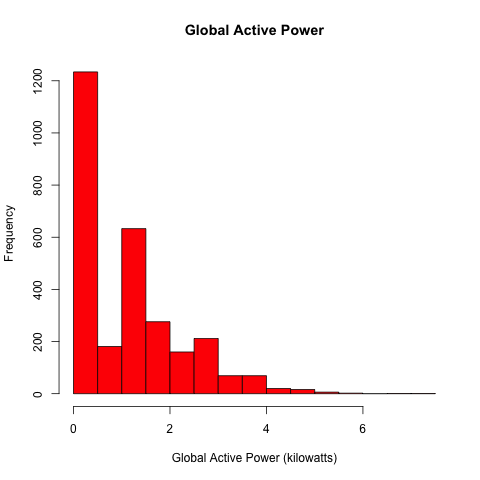
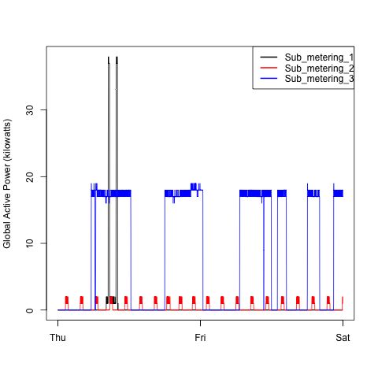
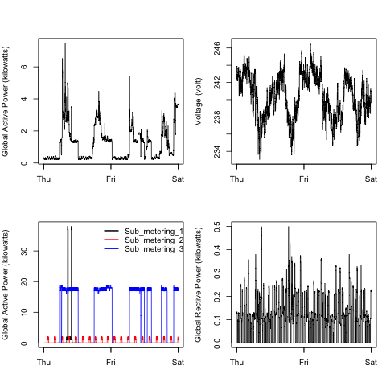

## Introduction

Need to download the dataset for the script to work.

* <b>Dataset</b>: <a href="https://d396qusza40orc.cloudfront.net/exdata%2Fdata%2Fhousehold_power_consumption.zip">Electric power consumption</a> [20Mb]

## Running the script

Enter R console in terminal, use `source()` to run the script.

### Plot 1

 

### Plot 2

 

### Plot 3

 

### Plot 4

 

